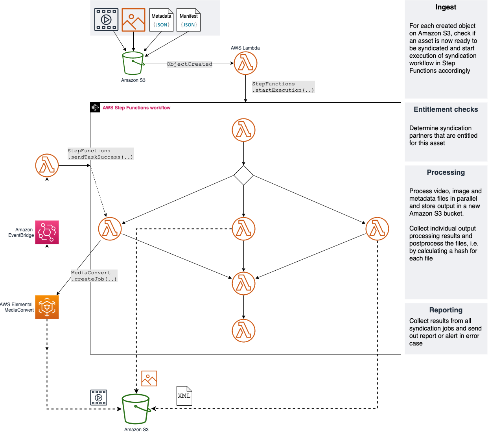
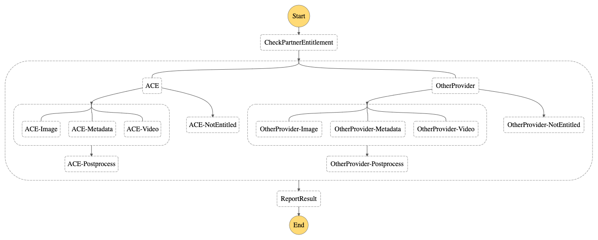
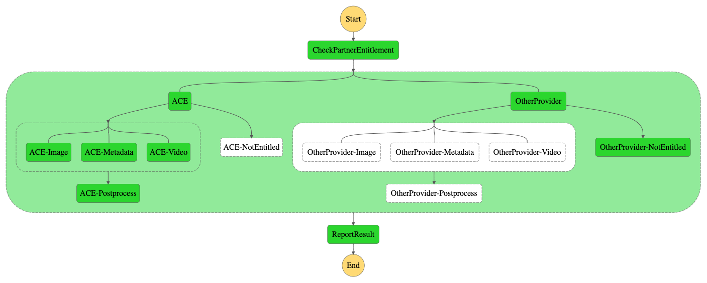

# Serverless Content Syndication with AWS Step Functions

This repository contains the full source code that is used in the technical guide [Create a Serverless Content Syndication Pipeline with AWS Step Functions](https://d1.awsstatic.com/whitepapers/create-a-serverless-content-syndication-pipeline-with-aws-step-functions.pdf)

## Solution Overview



### Prerequisites

- An [AWS account](https://signin.aws.amazon.com/signin)
- Installed and authenticated [AWS CLI](https://docs.aws.amazon.com/en_pv/cli/latest/userguide/cli-chap-install.html) (authenticate with an [IAM](https://docs.aws.amazon.com/IAM/latest/UserGuide/getting-started.html) user or an [AWS STS](https://docs.aws.amazon.com/STS/latest/APIReference/Welcome.html) Security Token)
- Installed and setup [AWS Cloud Development Kit (AWS CDK)](https://docs.aws.amazon.com/cdk/latest/guide/getting_started.html)

### Let’s get you started

#### 1. Make sure you completed the prerequisites above and cloned this repo.

```
git clone git@github.com:aws-samples/serverless-content-syndication-with-aws-step-functions.git
```

#### 2. Open the repository in your preferred IDE and familiarize yourself with the structure of the project.

```
.
├── cdk             CDK code that defines our environment
├── img             Images used in this README
├── fixtures        Testfiles and a script to upload them to S3 to trigger an execution
└── src
    ├── handlers    Handler code of the lambda functions used by the state machine
    └── lib         Dependencies of our lambda functions that will be put into a LambdaLayer
```

#### 3. Install dependencies

node.js dependencies are declared in a `package.json`.
This project contains a `package.json` file in three different folder: 
- `cdk`: Dependencies required to deploy your stack with the CDK
- `src`: Dependencies that support app development, i.e. TypeScript types for AWS SDK 
- `src/lib/nodejs`: Dependencies required for your LambdaLayer

Navigate to each of the folders and run `npm install`
                             
#### 4. Configure your stack

Before we can deploy the stack, we need to set two parameters in `cdk/bin/cdk.ts`

**MediaConvertEndpointURL**

AWS Elemental MediaConvert is a file-based video transcoding service that we'll use to transcode our video. All requests for MediaConvert are sent to a dedicated endpoint (`MediaConvertEndpointURL`) of your account and region, which you can find by running the following command:

```
aws mediaconvert describe-endpoints --query "Endpoints[*].Url" --output text
```

**BucketPrefix**

You need to provide an [Amazon S3 compliant](https://docs.aws.amazon.com/AmazonS3/latest/dev/BucketRestrictions.html) string that will be used to prefix the created buckets as follows:

```
<prefix>.source         -> Source bucket to upload input files to
<prefix>.partner.ace    -> Output bucket for syndication partner ACE
```

#### 5. Transpile TypeScript to JavaScript

Our CDK and Lambda code is written in TypeScript, an extension to JavaScript that adds static types and other useful features. 

To run our code with the node.js Lambda runtime, we need to transpile the TypeScript into JavaScript, by running `npm run build` in the `cdk` and `src` folder. This will transpile the code once - if you want to keep watching the code for changes and automatically transpile after a change, run  `npm run watch`

#### 6. Deploy your application

Navigate to the `cdk` folder and run the following commands

```
cdk synth 
cdk bootstrap
cdk deploy
```

`cdk synth` will synthesize a CloudFormation template from your CDK code. After bootstrapping the required resources for the CDK with `cdk bootstrap` you can then deploy the template with `cdk deploy`.

If you navigate to Step Functions in the AWS console, you will now see the following definition of a step functions workflow:



#### 7. Test the state machine

Run `source upload.sh <BucketPrefix>.source` in `fixtures` to upload test files to the source bucket you just created - `BucketPrefix` is the value you set in `cdk/bin/cdk.ts`. After the files are uploaded, you can see your state machine running through the different steps and creating your output files in the provided destination bucket.



## Cleaning up

When you are done, make sure to clean everything up.

Run the following command to shut down the resources created in this workshop.

```
cdk destroy
```
If you test the workflow, source and destination buckets will contain files. Cloudformation does not delete non-empty buckets and thus `cdk destroy` will not delete those buckets.

If you are sure the created buckets + files can be deleted, you can use the AWS CLI, but be aware that this will completely wipe the given bucket

```
# ATTENTION: This is a destructive action that will wipe your bucket completely

aws s3 rb s3://<bucket-name> --force  
```

## License

This library is licensed under the MIT-0 License. See the LICENSE file.


